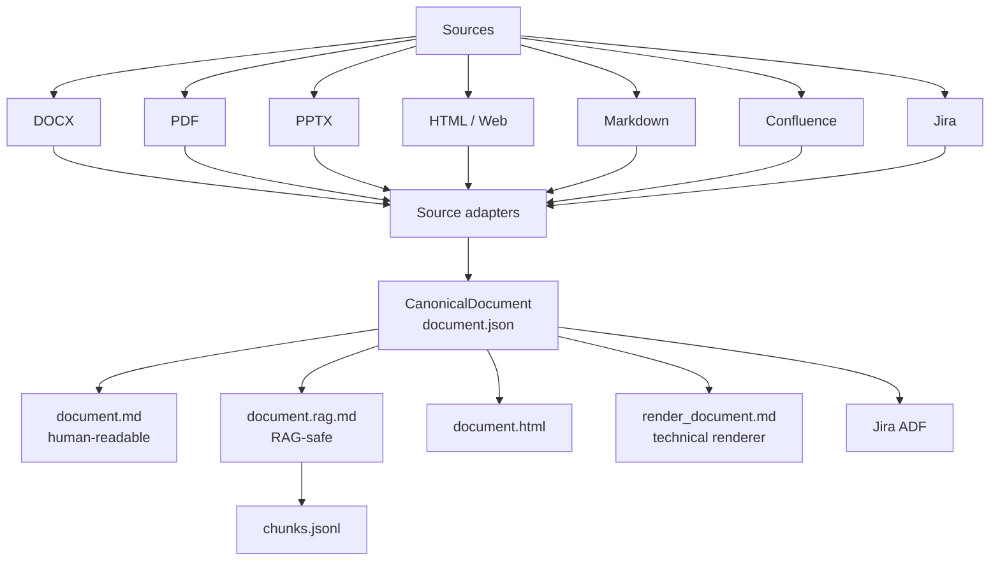
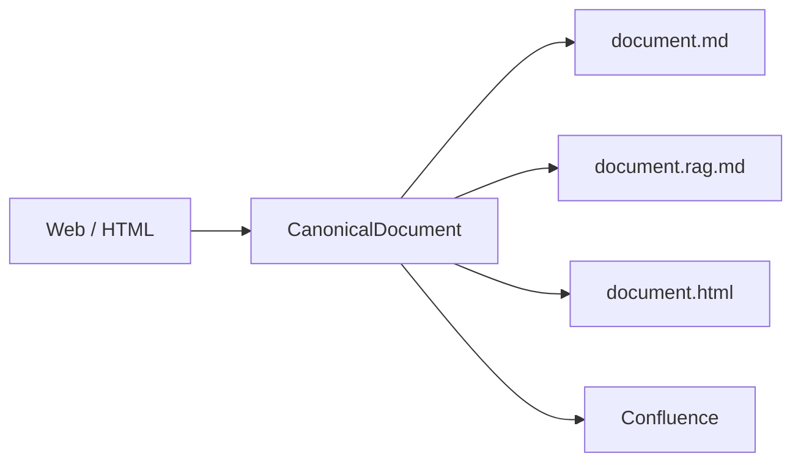
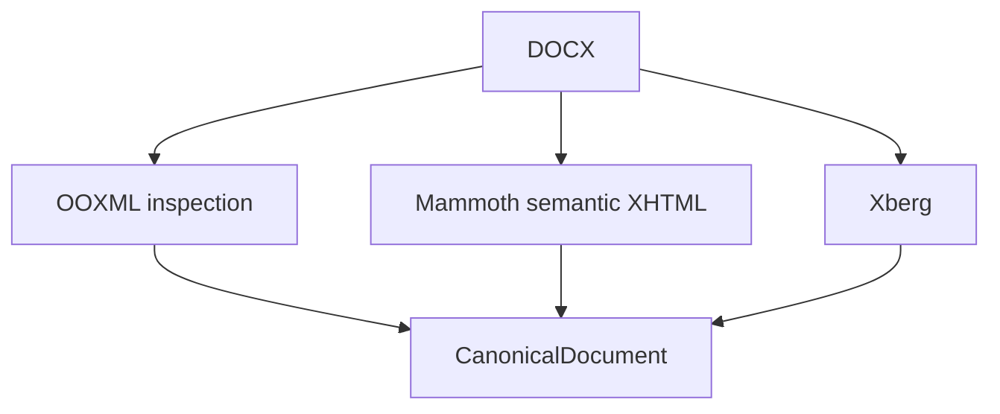
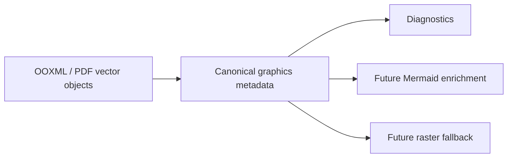

# DocSpecBridge 0.4.2

DocSpecBridge is a specification bridge for **DOCX / PDF / PPTX / HTML / Markdown / Confluence Cloud / Jira Cloud**.

The 0.4 line introduces a real **CanonicalDocument**: source adapters populate one structured JSON model, then human Markdown, RAG Markdown, portable HTML, Confluence publication markup and Jira ADF are rendered from that model.



## Why 0.4 is structurally different

Markdown is no longer the lossless pivot. In particular, a merged table cell is stored once with its `rowspan` / `colspan` in `document.json`.

Example canonical cell:

```json
{
  "type": "table_cell",
  "colspan": 6,
  "rowspan": 1,
  "blocks": [
    {
      "type": "paragraph",
      "inlines": [
        {"type": "text", "text": "4.0", "marks": []}
      ]
    }
  ]
}
```

The human Markdown and RAG views therefore contain `4.0` **once**, while the Confluence renderer restores `colspan="6"`.

## Package layout

A source such as `specification.docx` produces:

```text
output/
└── specification__docx/
    ├── specification.docx        # original source copy
    ├── document.json             # canonical source of truth
    ├── document.md               # clean, readable Markdown
    ├── document.rag.md           # clean RAG view
    ├── document.html             # portable HTML view
    ├── manifest.json
    ├── rag.json
    ├── chunks.jsonl
    ├── render_document.md        # technical XHTML/Markdown for md2conf
    ├── publication_state.json    # created after publication; target page IDs/state
    ├── images/
    └── publication_images/
```

`document.md` is intentionally readable as text. Confluence-specific XHTML is kept in the separate `render_document.md` technical artifact at package root so local image references stay simple (`images/...`).


## 0.4.2 patch

0.4.2 keeps the 0.4 canonical architecture and makes Confluence publication explicit and verifiable:

- publication modes: `replace` (synchronize the intended page) and `add` (always create a copy, adding ` (2)`, ` (3)`, ... when the title already exists in the space);
- destination page IDs are stored in `publication_state.json`, never injected back into `render_document.md`;
- publication is verified through the Confluence REST API before DocSpecBridge reports success, so a fast failed/draft publication is not displayed as successful;
- interactive publication shows a real pre-filled editable title field before confirmation;
- the default page title can come from the detected document title or from the source filename;
- document-title detection uses native metadata when reliable and format-specific fallbacks (for example Word Core Properties / a prominent early DOCX title, the first PowerPoint slide title, PDF metadata, or a visible HTML heading).

The 0.4.1 fixes remain in place: `render_document.md` stays at package root with simple `images/...` paths, and the space-root selector uses the real Confluence `homepageId`.

## Main commands

```powershell
docspecbridge                    # interactive menu
docspecbridge config             # settings UI
docspecbridge extract            # local files -> canonical packages
docspecbridge publish            # package(s) -> Confluence Cloud
docspecbridge doc2wiki           # local docs -> extract -> Confluence
docspecbridge doc2rag            # local docs -> extract -> portable RAG corpus
docspecbridge rag-export         # existing packages -> portable RAG corpus

docspecbridge conf2md --page-id 123456789
docspecbridge jira2md --issue ABC-123
docspecbridge md2jira --source .\story.md --project ABC --issue-type Story
docspecbridge web2md --url https://example.org/page
docspecbridge html2md --source .\page.html
docspecbridge md2html --source .\page.md

docspecbridge spaces
docspecbridge root-pages --space-id 123456 --depth 2
docspecbridge doctor
```

## HTML / Web support

HTML is both a source and a destination in 0.4.

Local HTML/HTM files can be processed by `extract` or `html2md`. Remote web pages can be fetched with `web2md`; the returned source HTML is preserved as `source.html`. DocSpecBridge prefers `<main>` or `<article>` when available, falls back to `<body>`, removes executable/style payloads from the canonical prose, and can copy/download referenced images into the package.

Every canonical package also produces `document.html`, independently from the Confluence renderer.

This means a web page can follow the same pipeline:



## DOCX adapter

Mammoth does **not** replace Xberg globally.

For DOCX, Mammoth + direct OOXML inspection provide the strongest structural view for publication/canonical modelling; Xberg remains useful for extraction, image handling, diagnostics and the wider format set.



The adapter preserves where possible:

- merged table cells (`rowspan` / `colspan`);
- headings and Word outline levels;
- Word heading numbering;
- lists;
- bold / italic / underline;
- highlight colours and table-cell colours;
- checkboxes;
- image references and display dimensions;
- source TOC semantics without obsolete page numbers.

Header images can be injected once into the canonical document for publication while remaining excluded from RAG by default.

## Human Markdown vs RAG Markdown

`document.md` and `document.rag.md` are independent renderings of `document.json`.

For a merged table, Markdown cannot visually reproduce the merge, so covered cells are rendered blank instead of repeating content. The merge metadata remains in the canonical JSON for richer targets.

The RAG view additionally omits navigation-only TOC content and, by default, decorative/header/footer images. Layout geometry and colours stay in JSON, not in indexed text.

## Confluence Cloud

Multiple Confluence Cloud instances are supported. Secrets remain in environment variables, not YAML.

```yaml
confluence:
  default_instance: production
  instances:
    production:
      domain: company.atlassian.net
      auth_type: classic
      user_name: user@example.com
      token_env: ATLASSIAN_API_TOKEN
      default_space: DOC
      root_page: ""
```

### Interactive browsing of spaces and pages

Run `docspecbridge` and select **Confluence** to access publication, page export, space listing and the page-tree selector. Confluence organizes pages into **spaces**; the menu lets you select a configured instance, browse its available spaces and inspect their page hierarchy up to the configured depth.

You can save a selected space and parent page as defaults in your local YAML. The page selector displays titles and real page IDs, including the space homepage. Use Up/Down, PageUp/PageDown and Home/End to navigate, Enter to select and Esc to return.

Typical menu paths (labels follow the configured language):

| Goal | Menu path |
|---|---|
| Browse available spaces | Confluence → List spaces |
| Browse the page hierarchy and choose defaults | Confluence → Select space / root page |
| Publish an existing package | Confluence → Import / publish → instance → space → replace/add → parent → editable title → confirmation |
| Export a Confluence page | Confluence → Export → instance → page ID |

The export action currently asks for a page ID; it does not select the source page through the tree. The hierarchy selector is used for publication destinations and configuration defaults.

### Parent-page selector

The selector always exposes a **space root** entry backed by the real Confluence `homepageId`.

```yaml
confluence:
  page_selector:
    max_depth: 0
```

- `0`: space root + first-level pages;
- `1`: + their children;
- `2`: + grandchildren.

The interactive list uses a terminal-height-aware scrolling viewport and tree glyphs (`├─`, `│`, `└─`) so hierarchy remains visible.

### Publication policy

```yaml
confluence:
  publication:
    default_mode: replace              # replace | add
    page_title_source: document_title  # document_title | filename
    add_title_suffix: " ({n})"
    verify_after_publish: true
```

`document_title` falls back automatically to the source filename if no reliable title can be detected. In the interactive flow the proposed title is inserted into a real editable field, so pressing Enter accepts it and typing changes it.

`replace` updates the known page at the selected destination when possible. `add` never replaces an existing page and chooses a unique title in the target space when necessary. Persistent Confluence page IDs live in `publication_state.json`; `render_document.md` remains target-agnostic.

After publication DocSpecBridge re-reads Confluence and only reports success once the expected current page, title, space and parent are confirmed.

### Page width

```yaml
confluence:
  page_width: max
```

Values: `narrow`, `wide`, `max`, `confluence-default`. Default is `max`.

Publishing shows a spinner and reports elapsed time on success or failure.

### Confluence as a source

`conf2md` downloads the page Storage Format, stores the raw page JSON/storage beside the canonical package, retrieves available attachments, and builds `document.json` + the standard views.

Common Confluence constructs are normalized; unsupported macros remain preserved in the original Storage Format for future adapters.

## Jira Cloud

0.4 adds initial Jira source/target support using REST API v3 and ADF. **Jira support is limited in 0.4.2 and is planned to evolve in the next release.**

The interactive **Jira** menu currently provides two actions:

- **Export a Jira issue to DocSpecBridge**: enter an issue key to generate a canonical package and its Markdown, HTML and RAG views.
- **Create a Jira issue from Markdown**: provide a Markdown file, project key, issue type, optional summary and optional parent issue key.

This release does not provide interactive project/issue browsing, updates to existing issues, configurable custom-field/acceptance-criteria mappings or attachment/media upload. Export preserves the raw issue JSON, but the rendered document primarily contains the summary, issue type, status and description; other fields are not all rendered or downloaded as assets.

The next release is intended to expand Jira support, with the backlog covering richer field mappings, attachment handling and further ADF validation. The exact scope remains to be finalized.

`jira2md` stores the raw issue JSON and converts the issue description from ADF into CanonicalDocument.

`md2jira` converts portable Markdown into CanonicalDocument then Jira ADF before creating the issue. Common ADF nodes supported in this release include headings, paragraphs, emphasis, links, lists, blockquotes, code blocks and tables (including rowspan/colspan).

If `jira.instances` is empty, Jira commands can reuse matching Confluence instance credentials, which is convenient when both products share the same Atlassian Cloud site/token.

```yaml
jira:
  default_instance: ""
  instances: {}
```

## Vector graphics and Mermaid

0.4 records vector/diagram diagnostics in the canonical model instead of silently treating them as ordinary text. Full Office vector rendering is **not** claimed yet.



Mermaid is treated as an enrichment, never as a destructive replacement of the source visual. When a reliable graph can later be derived from shapes/connectors, the canonical block can keep both the original/fallback visual and a Mermaid representation.

## RAG

```yaml
profiles:
  rag:
    enabled: true
    token_reduction: off
    keep_image_references: true
    include_header_images: false
    include_footer_images: false
    chunking:
      enabled: true
      max_characters: 1600
      overlap: 150
      prepend_heading_context: true
```

`chunks.jsonl` is generated from `document.rag.md`, itself rendered directly from CanonicalDocument. This prevents merged-cell duplication from contaminating retrieval text.

### Portable corpus layout and document names

Generated filenames such as `document.md` and `document.rag.md` are standardized **inside each document package**. The document identity remains in the package directory, canonical metadata and manifest.

`doc2rag` and `rag-export` do not flatten every Markdown file into one directory. The exporter reads package manifests, selects their RAG Markdown and creates a separate directory per package:

```text
rag/
├── corpus.json
├── index.jsonl
├── chunks.jsonl
└── documents/
    ├── specification__docx__<document_id>/
    │   ├── document.rag.md
    │   ├── document.json
    │   ├── manifest.json
    │   ├── rag.json
    │   └── images/
    └── another-specification__pdf__<document_id>/
        ├── document.rag.md
        ├── document.json
        ├── manifest.json
        └── images/
```

`<document_id>` uses the first 16 characters of the source SHA-256 when available; otherwise it is derived from the package name. The Markdown basename is preserved, while its parent directory distinguishes the package. `index.jsonl` records its relative path, source metadata and assets; the aggregated `chunks.jsonl` adds document and package references to each chunk.

Downstream loaders should use `index.jsonl`, or recursively load `documents/**/document.rag.md` while preserving the full relative path. Manually copying these files into a flat directory would require unique filenames and updated image links.

This is a portable corpus export, not embedding generation or vector-store ingestion. By default, `rag_export.overwrite: true` rebuilds the destination rather than appending to an existing corpus; use a dedicated export directory.

## Languages

The interactive UI and CLI help support:

- French (`fr`)
- English (`en`)
- German (`de`)
- Spanish (`es`)
- Chinese (`zh`)

The language is read from the active YAML configuration before normal CLI help is built.

## Installation / development

```powershell
uv venv --python 3.14.7
.\.venv\Scripts\Activate.ps1
uv sync
docspecbridge doctor
pytest -q
```

## Current limits

- Complete rendering of arbitrary Word/PowerPoint DrawingML/VML/SmartArt remains a later step.
- `web2md` processes server-returned HTML and does not execute client-side JavaScript like a browser.
- Confluence macros without a canonical equivalent are preserved in the raw Storage Format but may be simplified in `document.md`.
- Jira media upload is not yet performed by `md2jira`; local image references remain text/link references until the dedicated attachment/media workflow is added.
- `conf2md` currently targets Confluence pages; whiteboard content is not exposed by the public REST API with the same structured fidelity as page Storage Format.
