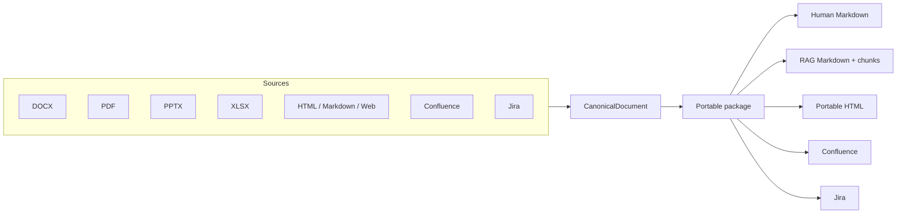
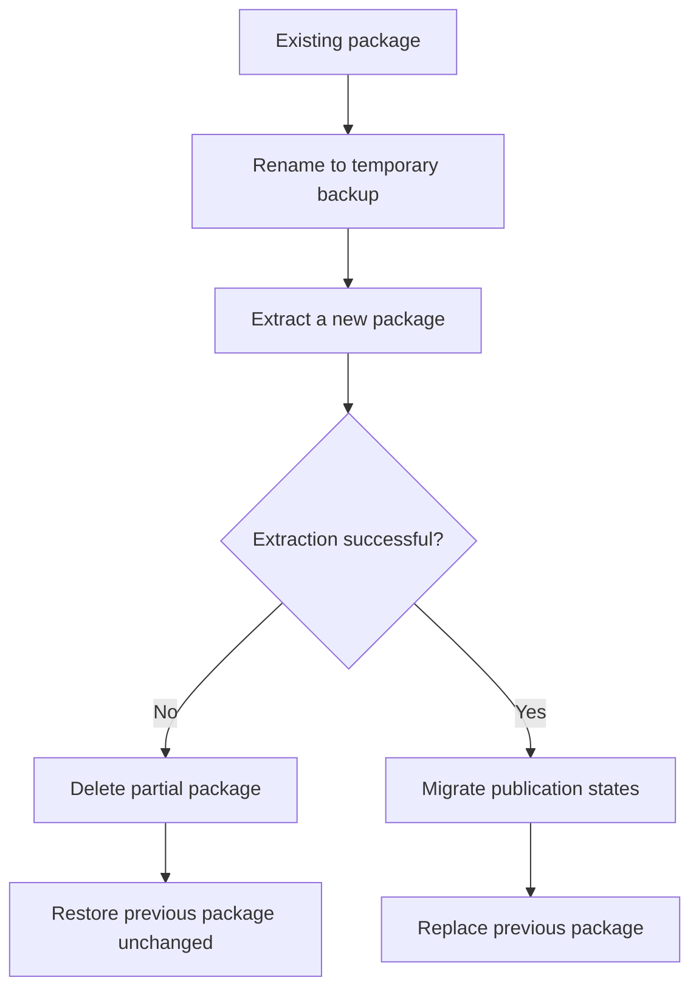

# DocSpecBridge

DocSpecBridge is a canonical specification bridge for **DOCX, PDF, PPTX, XLSX, HTML, Markdown, Web, Confluence Cloud and Jira Cloud**.

It separates source extraction from target publication:



The canonical JSON is the structural source of truth. Markdown is a readable view, not the lossless pivot. This makes it possible to preserve information such as merged cells, image geometry, source metadata and target-specific rendering hints without polluting the RAG view.

For version-by-version changes, see [CHANGELOG.md](CHANGELOG.md).

## Installation

DocSpecBridge requires Python 3.10 or newer. The repository suggests Python 3.14 through `.python-version`.

With `uv`:

```powershell
uv sync
uv run docspecbridge doctor
```

For an installed package:

```powershell
uv pip install -U docspecbridge
```

or, when installed as an uv tool:

```powershell
uv tool upgrade docspecbridge
```

## Interactive application

Run:

```powershell
docspecbridge
```

The main menu is intentionally organized by direction:

```text
Settings
Extract
Import
RAG
Help
Quit
```

The displayed language is controlled by `app.language` and supports:

- English (`en`)
- French (`fr`)
- German (`de`)
- Spanish (`es`)
- Chinese (`zh`)

Menus, prompts, help text, status messages, warnings and application-level errors use the selected language. English is the fallback language if a translation key is unavailable.

In interactive selectors, use arrow keys to navigate, **Enter** to confirm and **Esc** to cancel the current action and return to the previous menu.

## Configuration

DocSpecBridge looks for `docspecbridge.yaml`, `docspecbridge.yml`, `config.yaml` or `config.yml` in the current directory.

Configuration files carry explicit schema metadata:

```yaml
docspecbridge:
  config_schema_version: 2
  last_updated_by: "0.5.4"
```

`config_schema_version` controls structural migrations. `last_updated_by` records the DocSpecBridge version that last wrote or migrated the file.

When an older configuration schema is opened, DocSpecBridge:

1. creates a backup next to the YAML file;
2. applies each required schema migration in sequence;
3. writes the current configuration structure;
4. records the current schema and DocSpecBridge version.

A backup is named similarly to:

```text
docspecbridge.yaml.pre-0.5.4.bak
```

If a configuration uses a schema newer than the running application supports, DocSpecBridge refuses to modify it and asks the user to upgrade the application.

Source file extensions are application capabilities and are **not** stored in YAML. Supported local source types are detected by the application itself. `--extension/-e` remains available as a temporary command-line filter and is never persisted.

A complete example is available in [`config.example.yaml`](config.example.yaml).

### Generic CLI overrides

Any configuration key can be overridden for one invocation:

```powershell
docspecbridge --set profiles.rag.chunking.max_characters=2200 doc2rag
docspecbridge --set confluence.converter.render_mermaid=true publish --source .\output\specification__docx
```

Precedence is:

```text
defaults < YAML < explicit command options < --set
```

Use `docspecbridge config-keys` to inspect the effective configuration tree.

## Extract local documents

Default folders are `./input` and `./output`.

```powershell
docspecbridge extract
docspecbridge extract --source .\input --dest .\output
```

Supported local sources include DOCX, PDF, PPTX, XLSX, HTML/HTM and Markdown.

A source such as `specification.docx` produces a self-contained package:

```text
output/
└── specification__docx/
    ├── specification.docx
    ├── specification.json
    ├── specification.md
    ├── specification.rag.md
    ├── specification.html
    ├── specification.confluence.md
    ├── manifest.json
    ├── rag.json
    ├── chunks.jsonl
    ├── publication_state.json       # after Confluence publication
    ├── jira_publication_state.json  # after Jira publication
    ├── images/
    └── publication_images/
```

Readers resolve files through `manifest.json` first and retain compatibility fallbacks for older package names.

### Force Extract

Use **Force Extract** when a package must be regenerated while preserving its publication identity, for example after upgrading DocSpecBridge and rebuilding an already-published corpus.

CLI:

```powershell
docspecbridge extract --force-extract
```

The interactive Extract menu provides the same mode.

Force Extract is transactional:



It preserves and migrates:

- `publication_state.json` for Confluence page identity;
- `jira_publication_state.json` for Jira publication resume state.

For Confluence, the preserved `page_id` remains the strong identity even if the page title was manually changed after the original publication. For Jira, the package fingerprint stored in the state is updated to the newly generated manifest so a resumed import continues to target the existing issue.

`--overwrite` remains available as a destructive package replacement option. It does **not** provide publication-state preservation. Use `--force-extract` for migration/rebuild scenarios.

## XLSX

XLSX uses a native adapter so workbook and worksheet structure, formulas and charts can be represented explicitly. Formula expressions and cached values are recorded separately. When Excel has not stored a cached result, DocSpecBridge records that fact rather than inventing one. Common chart types receive portable SVG previews while the original workbook remains authoritative.

A workbook with a single worksheet is represented directly by the root package: there is no artificial landing page.

A workbook with multiple worksheets produces a workbook landing page plus one child package per worksheet. The landing page is a real navigation page:

- human Markdown links to the generated worksheet Markdown files;
- local HTML links to the generated worksheet HTML files;
- Confluence uses a dynamic child-page listing, while each worksheet is published as a child page below the workbook page.

This keeps local packages navigable and lets Confluence reflect the actual child-page hierarchy after publication.

## Confluence Cloud

Multiple Confluence Cloud instances are supported. Secrets are referenced through environment variables rather than stored in YAML.

Example:

```yaml
confluence:
  default_instance: production
  instances:
    production:
      domain: company.atlassian.net
      auth_type: classic
      user_name: user@example.com
      token_env: ATLASSIAN_API_TOKEN
      default_space: DOC
      root_page: ""
```

### Confluence as a source

Interactive discovery follows:

```text
Instance
  → Space
    → Page
      → attachment options
```

Configured defaults preselect the corresponding choice but never bypass discovery or hide the selected destination.

CLI example:

```powershell
docspecbridge conf2md --page-id 123456789 --attachments all
```

The raw Confluence page JSON and Storage Format are preserved in the package. Attachments can be downloaded as `none`, `images` or `all`.

### Import to Confluence

`replace` synchronizes an intended page. `add` creates a new copy with a unique title when necessary.

Publication identity is kept in `publication_state.json`, not injected permanently into generated Markdown.

When a `replace` state contains a Confluence `page_id`, DocSpecBridge treats that ID as authoritative. It verifies that the page still exists and belongs to the expected space and parent. If the page is missing, inaccessible or moved to a different destination, publication stops instead of silently creating a duplicate page.

If no publication state exists, `replace` can still resolve an existing page by title under the selected parent and otherwise create a new page.

Example publication settings:

```yaml
confluence:
  publication:
    default_mode: replace
    page_title_source: document_title
    add_title_suffix: " ({n})"
    verify_after_publish: true
    attachments: none
    attachment_zip: false
```

## Jira Cloud

Jira can be used both as an extraction source and an import target.

### Jira as a source

Interactive extraction offers two paths:

```text
Enter an issue key directly
or
Browse
  → Project
    → Issue type
      → paginated issue list
```

Selecting the issue type before issue retrieval narrows the JQL query and avoids loading hundreds or thousands of issues unnecessarily. The browser loads one page at a time; the default page size is 50 and can be configured up to 100.

Jira extraction can include:

- issue description and fields;
- paginated comments;
- attachments and inline images;
- optional changelog/history;
- Jira Service Management comment fallback when applicable.

A `<ISSUE>.comments.json` diagnostic file is written when comment extraction is requested, including when no accessible comments are returned.

### Import to Jira

The interactive path discovers the Jira instance, project and issue type before publication. The package title becomes the default Summary, CanonicalDocument content is converted to ADF, and local images/attachments are uploaded and inserted back into the issue description where possible.

`jira_publication_state.json` records partial progress. A retry can reuse the issue that was already created and skip attachments already uploaded.

## Web, HTML and Markdown

Local `.html` / `.htm` files placed directly in `input/` are processed through the same CanonicalDocument pipeline as other local sources. Markdown files are handled the same way. Remote web pages can be fetched with `web2md`; the server-returned HTML is preserved and referenced images can be downloaded into the package.

Fenced Mermaid blocks in Markdown are recognized as semantic diagram blocks rather than generic source code. Human Markdown and RAG Markdown preserve the original `mermaid` fence, local HTML marks the diagram with a `mermaid` class for downstream/browser rendering, and Confluence publication passes a real Mermaid block to `markdown-to-confluence`. Confluence rendering behavior is controlled by `confluence.converter.render_mermaid`: pre-rendering requires Mermaid CLI (`mmdc`), while non-rendered Mermaid requires a compatible Confluence Marketplace integration.

HTML extraction is currently semantic rather than a browser snapshot. Headings, paragraphs, lists, tables, links and images are normalized into the canonical model, while scripts and styles are deliberately not executed. As a result, JavaScript-heavy pages, iframe-driven content and layouts that depend strongly on CSS may lose runtime content or visual presentation. A future browser-rendered extraction mode can address those cases without changing the canonical publication pipeline.

```powershell
docspecbridge web2md --url https://example.org/page
docspecbridge html2md --source .\page.html
docspecbridge md2html --source .\page.md
```

## RAG

`document.rag.md`/`<source>.rag.md` is generated independently from the human Markdown. Navigation-only TOC content and decorative/header/footer imagery can be omitted without changing the publication representation.

Chunked output is written to `chunks.jsonl` and can be aggregated into a portable corpus:

```powershell
docspecbridge doc2rag
docspecbridge rag-export
```

## Main CLI commands

```powershell
docspecbridge                       # interactive application
docspecbridge --version
docspecbridge doctor

docspecbridge extract
docspecbridge extract --force-extract

docspecbridge conf2md --page-id 123456789
docspecbridge jira2md --issue ABC-123
docspecbridge web2md --url https://example.org/page

docspecbridge publish --source .\output\specification__docx
docspecbridge md2jira --source .\output\specification__docx --project ABC --issue-type Story

docspecbridge jira-projects
docspecbridge jira-issue-types --project ABC
docspecbridge jira-issues --project ABC --type Story

docspecbridge doc2rag
docspecbridge rag-export

docspecbridge config
docspecbridge config-show
docspecbridge config-keys
```

## Diagnostics

Run:

```powershell
docspecbridge doctor
```

Doctor reports the DocSpecBridge/Python/platform versions, key dependency versions, working directories, proxy presence and configured Confluence instances/token environment status.

## Development

```powershell
uv sync
uv run pytest
uv run ruff check .
uv build --no-sources
uvx twine check dist/*
```

The i18n test requires the English, French, German, Spanish and Chinese catalogs to contain the same translation-key set.

## Release history

See [CHANGELOG.md](CHANGELOG.md).
