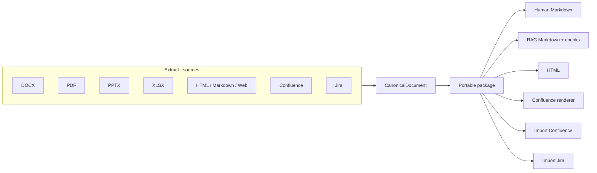
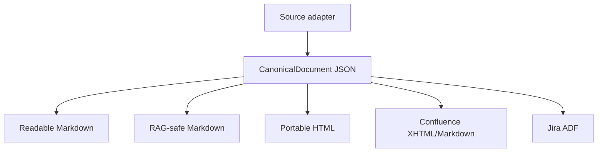

# DocSpecBridge 0.5.1

DocSpecBridge is a canonical specification bridge for **DOCX / PDF / PPTX / XLSX / HTML / Markdown / Web / Confluence Cloud / Jira Cloud**.

Version 0.5.1 keeps the CanonicalDocument architecture introduced in 0.4 and reorganizes the product around two explicit directions:

- **Extract**: a source becomes a portable canonical/Markdown package;
- **Import**: a package is published to a target such as Confluence or Jira.



## What changes in 0.5.x

### 1. Extract / Import menus

The interactive main menu is now deliberately small:

```text
Paramétrage
Extract — depuis les sources
Import — vers Confluence / Jira
RAG
Aide
Quitter
```

**Extract** contains local documents, Confluence, Jira and Web. **Import** contains Confluence and Jira. Legacy CLI commands remain available for automation and 0.4.x compatibility.

### 2. Source-specific output names

A source named `specification.docx` now produces human-facing files named after the source instead of generic `document.*` names:

```text
output/
└── specification__docx/
    ├── specification.docx
    ├── specification.json
    ├── specification.md
    ├── specification.rag.md
    ├── specification.html
    ├── specification.confluence.md
    ├── manifest.json
    ├── rag.json
    ├── chunks.jsonl
    ├── publication_state.json       # after Confluence publication
    ├── jira_publication_state.json  # after Jira publication
    ├── images/
    └── publication_images/
```

`manifest.json`, `chunks.jsonl`, `rag.json` and state files intentionally keep stable generic names. Readers use `manifest.json` first and fall back to the 0.4.x names (`document.json`, `document.md`, `render_document.md`, …), so existing packages remain readable.

## Canonical model

Markdown is not the lossless pivot. Structural information such as merged cells, image dimensions and source metadata lives in CanonicalDocument JSON and each target is rendered independently from it.



For example, a merged table cell exists once in CanonicalDocument with its `rowspan`/`colspan`; Markdown leaves covered cells blank instead of duplicating their contents while Confluence can restore the merge.

## XLSX support

XLSX has a native adapter in 0.5.0 rather than going through Xberg.

A workbook creates a root package plus one child package per worksheet:

```text
budget__xlsx/
├── budget.xlsx
├── budget.json
├── budget.md
├── budget.rag.md
├── budget.html
├── budget.confluence.md
├── budget.workbook.json
├── manifest.json
└── sheets/
    ├── 01-Budget/
    │   ├── Budget.json
    │   ├── Budget.md
    │   ├── Budget.rag.md
    │   ├── Budget.html
    │   ├── Budget.confluence.md
    │   └── images/chart_001.svg
    └── 02-Notes/
        └── ...
```

The workbook metadata records formulas and cached formula results separately. When Excel has not stored a cached result, the extraction records `cached_value_missing: true` rather than inventing a result. Common bar, line/scatter-like and pie charts receive a lightweight SVG preview; the original XLSX remains the authoritative source.

When such a package is imported into Confluence, DocSpecBridge publishes the workbook page first and then worksheet pages underneath it.

## Main commands

```powershell
# Interactive UI
docspecbridge

# Extract local documents
docspecbridge extract --source .\input --dest .\output

# Confluence/Jira/Web used as sources
docspecbridge conf2md --page-id 123456789
docspecbridge jira2md --issue ABC-123
docspecbridge web2md --url https://example.org/page

# Import targets
docspecbridge publish --source .\output\specification__docx
docspecbridge md2jira --source .\output\specification__docx --project ABC --issue-type Story

# Jira discovery
docspecbridge jira-projects --query ABC
docspecbridge jira-issue-types --project ABC

# RAG
docspecbridge doc2rag
docspecbridge rag-export

# Configuration / diagnostics
docspecbridge config
docspecbridge config-keys
docspecbridge doctor
```

### Override any YAML setting from the CLI

Every configuration key can be overridden with a repeatable global `--set dotted.path=value`. Its precedence is intentionally highest:

```text
defaults < YAML < explicit command options < --set
```

Examples:

```powershell
docspecbridge --set app.overwrite=true extract --source .\specs
docspecbridge --set profiles.rag.chunking.max_characters=2200 doc2rag
docspecbridge --set confluence.converter.render_mermaid=true publish --source .\output\spec__docx
docspecbridge config-keys
```

`config-keys` lists the effective configuration tree and therefore all dotted keys accepted by `--set`.

## Confluence Cloud

Multiple instances are supported. Secrets remain in environment variables.

```yaml
confluence:
  default_instance: production
  instances:
    production:
      domain: company.atlassian.net
      auth_type: classic
      user_name: user@example.com
      token_env: ATLASSIAN_API_TOKEN
      default_space: DOC
      root_page: ""
```

### Confluence as an Extract source

`conf2md` preserves the raw page JSON and Storage Format, then creates the canonical package. Attachment extraction is selectable:

```powershell
docspecbridge conf2md --page-id 123456789 --attachments all
docspecbridge conf2md --page-id 123456789 --attachments images
docspecbridge conf2md --page-id 123456789 --attachments none --zip-package
```

The interactive Extract flow exposes the same choices. Downloaded attached images are rewritten to local package paths when they are referenced by page content.

### Confluence Import

`replace` synchronizes the page identified for the selected instance/space/parent. `add` creates a new copy and chooses a unique title if necessary. Destination identity stays in `publication_state.json`; generated publication Markdown remains target-independent.

```yaml
confluence:
  publication:
    default_mode: replace
    page_title_source: document_title
    add_title_suffix: " ({n})"
    verify_after_publish: true
    attachments: none       # none | source | rendered | all
    attachment_zip: false   # also attach a ZIP of the complete package
```

When auxiliary attachments are enabled, DocSpecBridge skips a same-name/same-size file already attached to the page. Images referenced inline by the rendered page continue to be handled by the Confluence publication layer.

The Confluence width, hierarchy, comment and converter settings from 0.4 remain supported. `--render-mermaid` now correctly overrides `confluence.converter.render_mermaid`.

## Jira Cloud

Jira support is substantially expanded in 0.5.0.

### Jira as an Extract source

`jira2md` stores the raw issue JSON, converts the description from ADF, and can also retrieve:

- paginated comments (enabled by default);
- issue attachments, including images;
- custom/standard fields with their Jira field names;
- optional paginated changelog/history.

```yaml
jira:
  export:
    include_comments: true
    include_attachments: true
    include_changelog: false
```

Attachments are stored under `attachments/`. Downloads use Jira's authenticated attachment-content endpoint. Media references are matched by Jira media metadata, URL and filename/alt text; downloaded attachments are also exposed in an explicit **Attachments / Pièces jointes** section so non-inline files stay visible in Markdown/HTML packages. Comments are rendered in a dedicated localized section after the issue description.

Interactive Jira extraction first offers two explicit modes: **enter an issue key directly**, or **browse Jira**. Browse mode follows **instance → project → issue type → paginated issue list**. The issue type is applied to the JQL query before issues are fetched, so large projects are narrowed before display. The list contains at most 50 recently updated issues by default, with search/filter and next-page navigation. `Esc` remains available at each step. The page size is configurable with `jira.discovery.page_size` (1..100).

### Jira Import

The interactive flow is:


The title becomes `summary`; canonical content becomes the ADF `description`. Local images and package attachments are uploaded after issue creation, then the description is updated so image blocks stay at their original canonical positions.

A `jira_publication_state.json` file is written after every phase. If a publication fails after the issue has been created or after only some attachments were uploaded, rerunning the same package/project/type resumes from that state instead of creating a second issue. Existing same-name issue attachments are reused.

Useful discovery commands:

```powershell
docspecbridge jira-projects --query TEST
docspecbridge jira-issues --project TEST --type Story --limit 50
docspecbridge jira-issues --project TEST --type Story --query authentication
docspecbridge jira-issue-types --project TEST
```

If `jira.instances` is empty, Jira can reuse the Confluence Atlassian Cloud credentials.

## HTML / Web

HTML remains both a source and a rendered destination. Local HTML/HTM can be processed by `extract`/`html2md`; `web2md` downloads a remote HTML page, preserves the returned source, selects `<main>`/`<article>` when available and copies/downloads referenced images when configured.

Generated HTML uses the same canonical image paths as the package, so local images remain resolvable beside the HTML output.

## DOCX / PDF / PPTX

The 0.4 adapters remain in place. DOCX combines Mammoth and OOXML inspection for structure and formatting while Xberg remains the broader extraction engine. Existing handling of merged cells, lists, source TOCs, image geometry, PDF repeated images and OOXML media recovery is retained.

## RAG

`*.rag.md` is rendered directly from CanonicalDocument. `chunks.jsonl` is then generated from that view; navigation-only TOCs and decorative/header/footer images are excluded according to the RAG profile.

```yaml
profiles:
  rag:
    enabled: true
    keep_image_references: true
    include_header_images: false
    include_footer_images: false
    chunking:
      enabled: true
      max_characters: 1600
      overlap: 150
      prepend_heading_context: true
```

## Configuration compatibility

0.5.1 continues to migrate older YAML keys, including the legacy top-level `rag` profile and the old single-instance Confluence structure. Existing 0.4.x package readers are supported through manifest-first resolution plus legacy filename fallbacks.

## Installation / development

```powershell
uv venv --python 3.14.7
.\.venv\Scripts\Activate.ps1
uv sync
pytest -q
docspecbridge doctor
```

Python `>=3.10` is supported. XLSX support adds `openpyxl>=3.1,<4`.

## Current limits

- Arbitrary Word/PowerPoint DrawingML/VML/SmartArt still cannot be rendered losslessly without an Office-class layout engine.
- XLSX chart previews cover common chart families; uncommon/compound Excel chart types remain preserved as workbook/chart metadata and in the original XLSX but may not get a visual preview.
- `web2md` processes server-returned HTML and does not execute browser JavaScript.
- Confluence macros with no canonical equivalent remain preserved in raw Storage Format but can be simplified in human Markdown.
- Jira attachment insertion uses ADF external-media URLs backed by Jira attachment content URLs. The attachment itself remains authoritative even if a particular Jira renderer chooses to display that media as a link rather than an inline preview.
- `conf2md` targets Confluence pages; whiteboards do not expose the same Storage Format fidelity through the page API.

### Navigation interactive 0.5.x

Le menu interactif est organisé en **Paramétrage / Extract / Import / RAG / Aide** et suit la langue choisie dans `app.language` (`fr`, `en`, `de`, `es`, `zh`).

Les flux Confluence utilisent systématiquement la découverte **instance -> espace -> page**. Les valeurs par défaut servent à pré-positionner les sélecteurs mais restent visibles et modifiables. Pour l'extraction Jira, l'utilisateur choisit d'abord entre **saisie directe de la clé** et **découverte**. La découverte suit **instance -> projet -> type de ticket -> liste paginée des tickets**. Les valeurs Jira par défaut peuvent être configurées dans **Paramétrage > Jira Cloud**.

À toute étape interactive, **Esc** annule l'action en cours et revient au menu précédent.

### Formats sources et migration 0.5.1

Les formats sources pris en charge sont désormais une capacité interne de DocSpecBridge : DOCX, PDF, PPTX, XLSX, HTML/HTM et Markdown. Ils ne sont plus stockés dans `docspecbridge.yaml`. Une ancienne clé `app.extensions` est acceptée à la lecture pour compatibilité mais ignorée puis supprimée lors d'une sauvegarde. Cela évite qu'un ancien YAML masque un format ajouté par une nouvelle version.

Pour un filtrage ponctuel, la CLI conserve `--extension/-e` (répétable) sans modifier la configuration persistante.

Pour Jira, l'export des commentaires combine l'API Jira Platform et, lorsque nécessaire, le mécanisme Jira Service Management. Le package contient toujours `<ISSUE>.comments.json` lorsque `jira.export.include_comments` est activé, ce qui facilite le diagnostic des droits d'accès.
